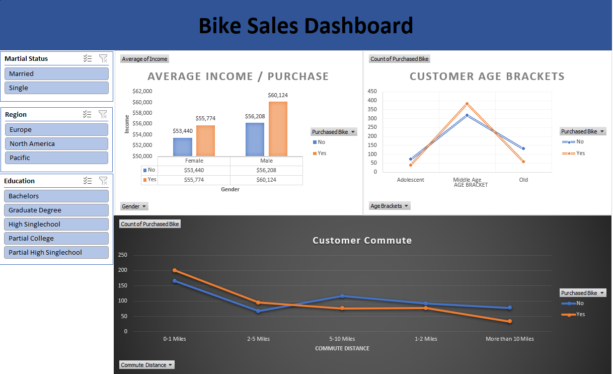
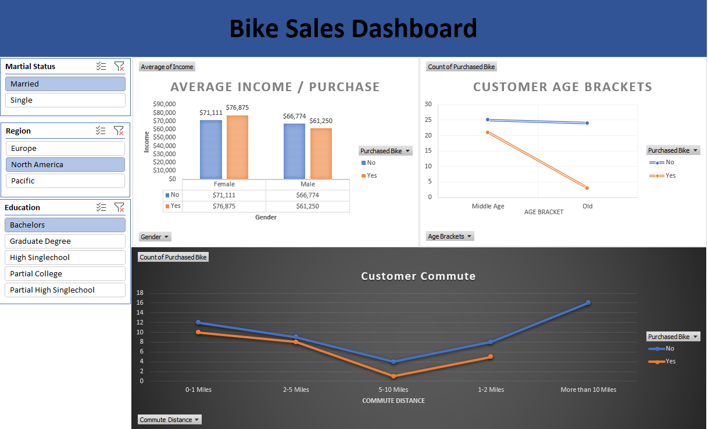
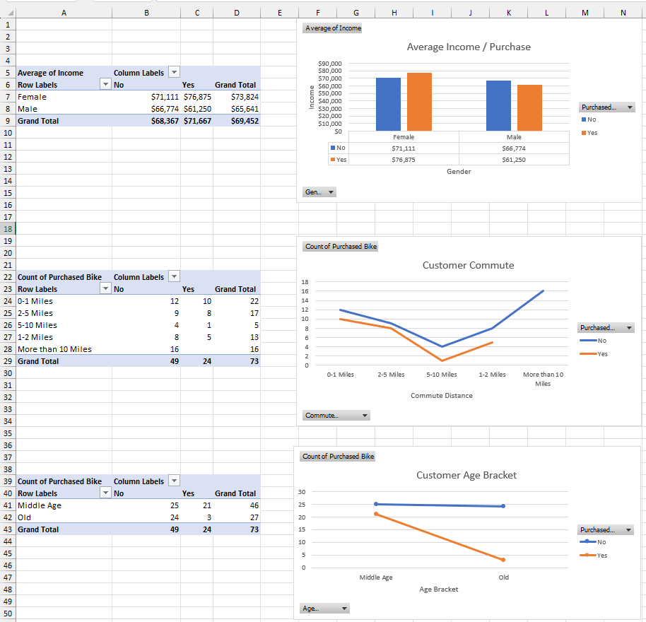

# 📊 Bike Sales Performance Dashboard

Welcome! This repository showcases an end-to-end data analytics project where I transformed raw, unorganized customer data into an interactive **Bike Sales Dashboard**. 

Data isn't just about rows and numbers; it's about human stories and consumer choices. This project explores the "why" behind bike purchases—analyzing how a person's income, age, marital status, and even their daily commute influence whether they buy a bike.

---

## 💡 What's Inside?

When exploring this project, you'll find three main components that highlight my data workflow:

### 1. The Interactive Dashboard
This is the core workspace where stakeholders can view high-level summaries at a glance. It translates complex datasets into a clean visual narrative.

### 2. Deep Dive with Dynamic Slicers
By implementing customized filters (Slicers) for **Marital Status**, **Region**, and **Education**, users can cut through the noise and segment the data dynamically to answer targeted questions in real time.

### 3. The Analytical Foundation (Pivot Tables)
Great visualizations require strong data architecture. This view showcases the underlying pivot tables, calculations, and structured frameworks that drive the visual charts on the front end.

---

## 🚀 Key Insights & Discoveries

While building this, a few fascinating customer trends jumped out:
* **The Sweet Spot for Income:** On average, individuals who purchased a bike had a higher income profile across both genders. For instance, North American female buyers averaged an income of over $76,000 compared to non-buyers at around $71,000.
* **The Middle-Age Boom:** The "Middle Age" bracket is by far the most active market segment. They hold both the highest volume of total shoppers and the most consistent conversion rate.
* **The Commute Factor:** Short-distance commuters (0–1 miles) are highly inclined to purchase bikes. However, as the commute stretches past 10 miles, the conversion rates drop off dramatically—showing that convenience strongly guides the purchase choice.

---

## 🛠️ Tools & Skills Demonstrated

* **Data Cleaning & Transformation:** Removing duplicates, resolving missing metrics, and utilizing conditional nested formulas to create clean categorical groups (like the Age Brackets).
* **Data Architecture:** Structuring custom Pivot Tables to aggregate data seamlessly without lagging performance.
* **UI/UX Dashboard Design:** Applying cohesive, professional color palettes, intentional typography, aligned charts, and clear interactive slicing elements to prioritize readability.

---

## 📂 Repository Structure

* `Bike_Sales_Dashboard.xlsx` — The complete interactive workbook containing the raw data, pivot tables, and final dashboard.
* `Dashboard.png`, `Dashboard with slices.png`, `Pivot Tables.png` — Visual snapshots used for documentation.

---

## 👋 Let's Connect!

Thank you for checking out my project! I love talking about data strategy, visualization best practices, or business analytics. 

If you have any feedback or just want to chat about data, feel free to connect with me:
* **LinkedIn:** https://www.linkedin.com/in/aliabdulnabii/
* **Email:** ali_abedlnabi@hotmail.com

---
*Tip: If you download the `.xlsx` file to test it out locally, don't forget to click **"Enable Content"** at the top of Excel so the dynamic slicers update perfectly when you click them!*
